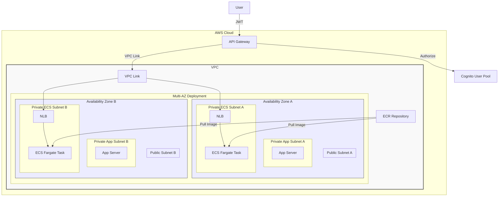

# AWS ECS Fargate Architecture Plan

This document outlines the plan for a resilient and scalable AWS infrastructure using a custom VPC and ECS Fargate.

## Architecture Diagram

Here is a Mermaid diagram illustrating the proposed architecture.

## Architecture Details

### VPC and Networking

*   **VPC CIDR Blocks:**
    *   **Primary:** `10.0.0.0/16` for general-purpose networking (app servers, databases, etc.).
    *   **Secondary:** `172.10.0.0/16` dedicated to the ECS container network to conserve IP addresses in the primary range.
*   **Availability Zones (AZs):** The architecture spans two AZs for high availability.
*   **Public Subnets:**
    *   One public subnet in each AZ (`10.0.10.0/24` and `10.0.20.0/24`) from the primary CIDR.
    *   These subnets have a route to the Internet Gateway (IGW). They are included to provide a DMZ for any future public-facing resources, but are not used for outbound traffic from the private subnets.
*   **Private "App" Subnets:**
    *   One private subnet in each AZ (`10.0.1.0/24` and `10.0.2.0/24`) from the primary CIDR.
    *   These are for general application resources like EC2 instances or RDS databases.
    *   Their default route points to the NAT Gateway in their respective AZ.
*   **Private "ECS" Subnets:**
    *   One private subnet in each AZ (`172.10.1.0/24` and `172.10.2.0/24`) created from the **secondary CIDR block**.
    *   These subnets are dedicated to running ECS Fargate tasks and are completely isolated from the public internet.

### ECS Fargate

*   **Multi-AZ Deployment:** The ECS cluster is configured to launch tasks across the dedicated **Private ECS subnets** in both AZs.
*   **Networking Mode:** ECS Fargate tasks will use the `awsvpc` network mode. Each task gets its own Elastic Network Interface (ENI) and a private IP address from the secondary CIDR range (e.g., `172.10.1.x` or `172.10.2.x`), effectively separating container traffic from other application traffic at the network level.

### API Gateway Access

To securely expose the ECS service to the internet, an API Gateway is used as the public-facing entry point. This is achieved through the following components:

*   **API Gateway:** An HTTP API Gateway provides a public endpoint for users to access the service.
*   **VPC Link:** A VPC Link creates a private and secure connection between the API Gateway and the resources within the VPC, without exposing them to the public internet.
*   **Network Load Balancer (NLB):** An internal Network Load Balancer is deployed in the private ECS subnets. It receives traffic from the API Gateway via the VPC Link and distributes it to the ECS Fargate tasks.
*   **Security Groups:** A dedicated security group is attached to the VPC Link. A specific ingress rule is added to the ECS task security group to allow traffic only from the VPC Link's security group on the required port, ensuring a secure and isolated environment.

### Authentication

*   **Cognito User Pool:** A Cognito User Pool is used to manage user authentication. It provides a secure and scalable solution for user sign-up and sign-in.
*   **API Gateway Authorizer:** The API Gateway is configured with a JWT authorizer that uses the Cognito User Pool to validate the JSON Web Tokens (JWTs) sent by the client in the `Authorization` header of the request. This ensures that only authenticated users can access the API.

### ECR Integration

*   **Private Image Storage:** An Amazon ECR (Elastic Container Registry) repository is used to securely store and manage the private container images for the ECS service.
*   **VPC Endpoints:** VPC endpoints for ECR and S3 are deployed in the VPC. This allows the ECS tasks to pull container images from the private ECR repository over the private AWS network, without requiring any internet access.
*   **IAM Permissions:** The ECS task execution role is granted the necessary IAM permissions to pull images from the private ECR repository.
